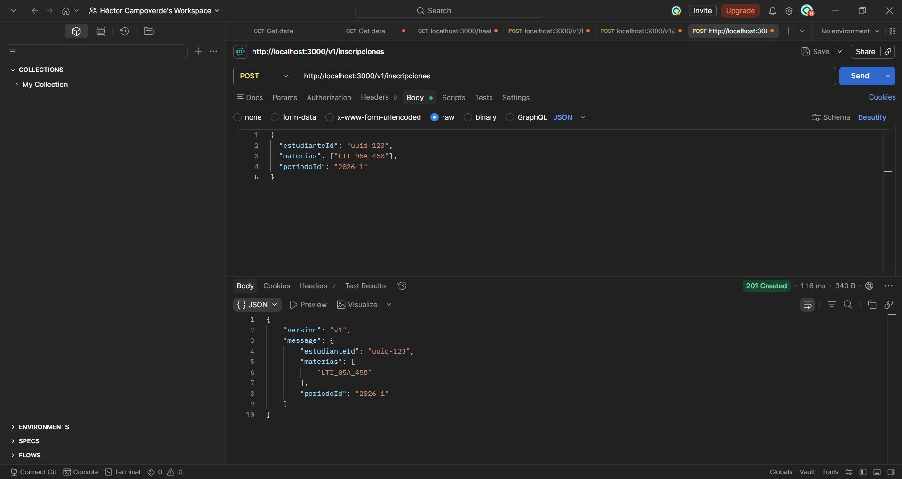
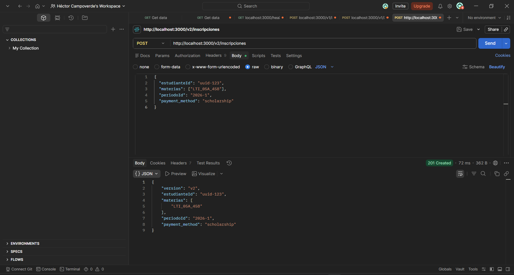
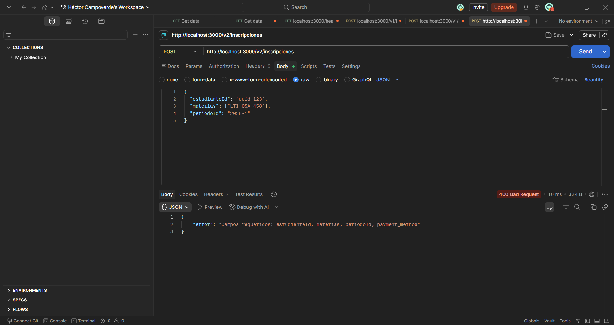
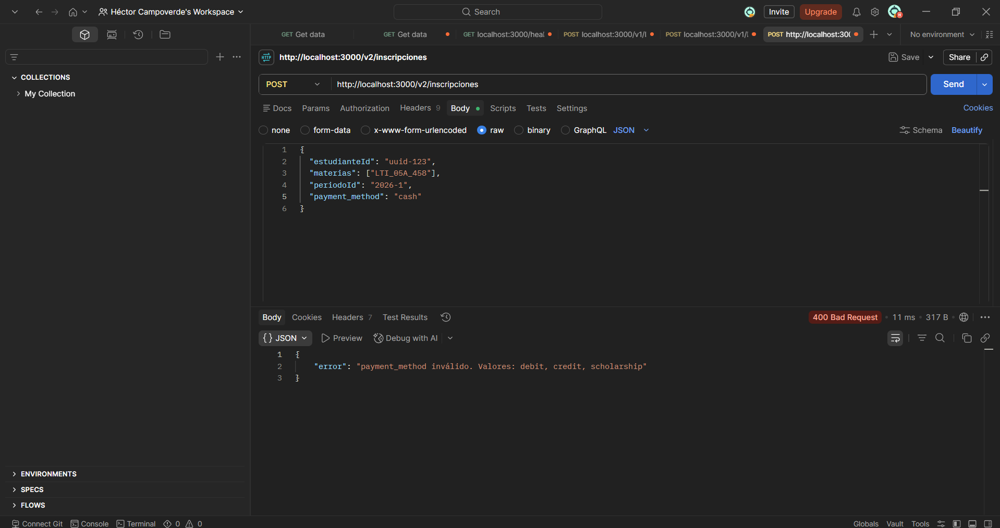

# PE-2.1: Configuración y primer servicio middleware con Node.js

## Pruebas de los escenarios

**a) Sin API key**
* **Comando:** `curl http://localhost:3000/health`
* **Salida real:** `{"error":"API key inválida o ausente"}`
* **Explicación:** El middleware de autenticación rechaza la petición con un código 401 porque no se incluyó el encabezado `x-api-key`.

**b) Con clave válida**
* **Comando:** `curl.exe -H "x-api-key: secreto-demo" http://localhost:3000/health`
* **Salida real:** `{"status":"ok","ts":"2026-06-11T20:36:26.545Z"}`
* **Explicación:** La petición incluye la clave correcta, por lo que el middleware permite el paso y el servidor responde con estado 200 y el timestamp actual.

**c) Ruta inexistente**
* **Comando:** `curl.exe -H "x-api-key: secreto-demo" http://localhost:3000/noexiste`
* **Salida real:** ```html
<!DOCTYPE html>
<html lang="en">
<head>
<meta charset="utf-8">
<title>Error</title>
</head>
<body>
<pre>Cannot GET /noexiste</pre>
</body>
</html>


## TA-2.1 Pruebas unitarias básicas
Para comprobar que los interceptores (el logger y el verificador de API Key) funcionan correctamente frente a diferentes escenarios, implementé pruebas unitarias usando Jest. Esto me permite validar la lógica de los middlewares sin necesidad de levantar el servidor de Express.

**Comando de ejecución:**
npm test

**Output de las pruebas:**
\`\`\`text
> api-hector@1.0.0 test
> jest --config jest.config.js

ts-jest[config] (WARN) message TS151001: If you have issues related to imports, you should consider setting `esModuleInterop` to `true` in your TypeScript configuration file (usually `tsconfig.json`). See https://blogs.msdn.microsoft.com/typescript/2018/01/31/announcing-typescript-2-7/#easier-ecmascript-module-interoperability for more information.
 PASS  src/middlewares/auth.test.ts
 PASS  src/middlewares/logger.test.ts

Test Suites: 2 passed, 2 total
Tests:       5 passed, 5 total
Snapshots:   0 total
Time:        0.512 s, estimated 1 s
Ran all test suites.


## PE-2.2 Documentación y versionado de API 
## Documentación de Endpoints

## Pruebas de los endpoints
Servidor corriendo en `http://localhost:3000`. Autenticacion: header `x-api-key: secreto-demo`.

### Escenario 1 — POST /v1/inscripciones con campos válidos (esperado: 201)


### Escenario 2 — POST /v2/inscripciones con payment_method válido (esperado: 201)


### Escenario 3 — POST /v2/inscripciones sin payment_method (esperado: 400)


### Escenario 4 — POST /v2/inscripciones con payment_method inválido (esperado: 400)



## TA-2.2 Documento OpenAPI refinado
## Reflexión sobre el Contrato de la API

Si otro equipo empezara a consumir esta API mañana, el principal cambio que implementaría en el contrato OpenAPI sería detallar exhaustivamente los esquemas de seguridad (como la autenticación mediante JWT) y añadir ejemplos de respuestas concretas (*mock data*) para cada código de estado HTTP. Esto permitiría al equipo consumidor generar entornos de prueba automáticos y avanzar con el desarrollo del *frontend* o integraciones móviles sin depender de que el *backend* esté completamente desplegado. Adicionalmente, especificaría políticas de *Rate Limiting* y documentaría claramente la estrategia de versionado y depreciación de rutas, garantizando que futuras actualizaciones en la lógica de negocio o en la base de datos no rompan sus sistemas en producción.

---
**Autor:** Héctor Campoverde